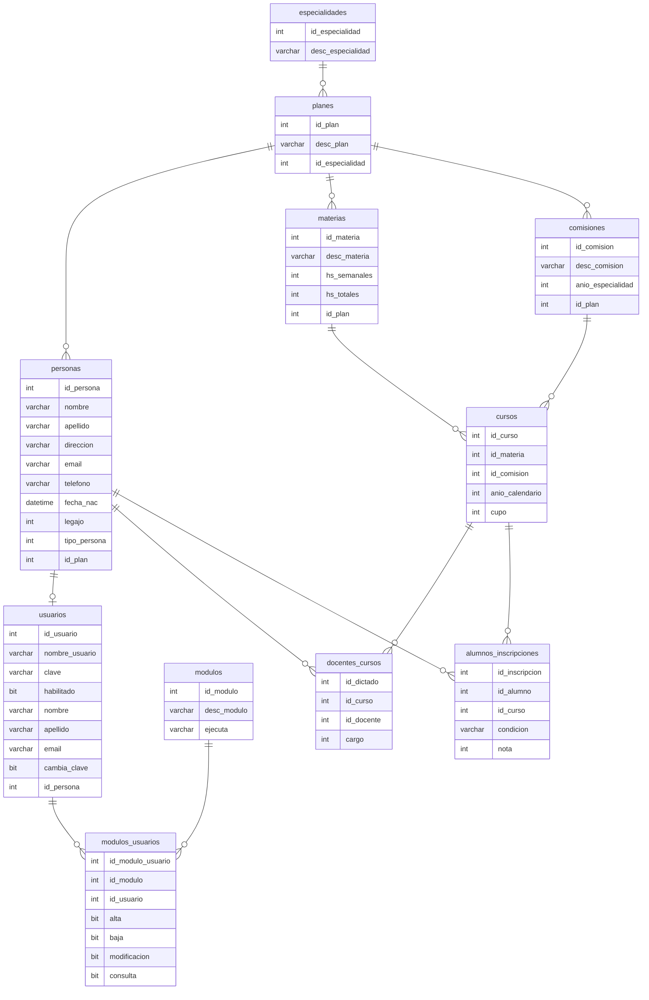

# Sistema de Gestión Académica (SGA) — TPI Academia

> **Trabajo Práctico Integrador**  
> **Materia:** Tecnologías de Desarrollo de Software IDE  
> **Universidad Tecnológica Nacional — Facultad Regional Rosario (UTN FRRo)**  
> **Año:** 2026

---

## Integrantes — Grupo N° 4

| Integrante | Legajo | 
| :--- | :---: | 
| **Martín Cabrera** | 53952 |
| **Nicolás Bolzico** | 53742 | 

---

## Sistema

El sistema elegido es el **Sistema de Gestión Académica (SGA)** propuesto por la cátedra.

